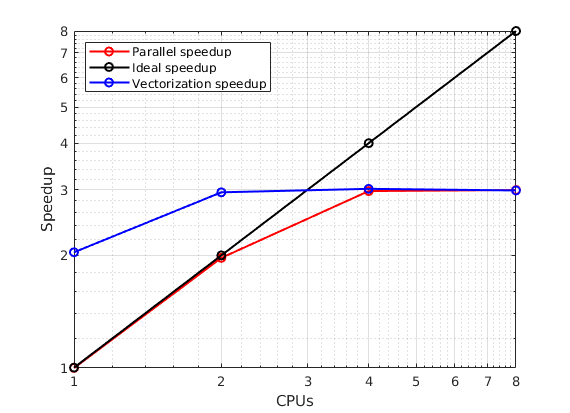

# Lab 1 report

Marc Aguilar and Alejandro Fernández

## Task 1: Dot product

### Exercise 2.2

> Submit a job executing the code with a vector size of 100M integers and obtain results for 1, 2, 4 and 8 threads (you can use the sample slurm script dotp job.cmd as a base for your job files). How does it scale? Plot the strong speedup.

| Number of threads | Sequential (ms) | Parallel time (ms) |
| ----------------- | --------------- | ------------------ |
| 1                 | 64.302          | 64.465             |
| 2                 | -               | 32.65              |
| 4                 | -               | 21.609             |
| 8                 | -               | 21.468             |

All the times presented in the previous table correspond to an average of 5 runs.

If we compute the speedup with the following formula: $speedup = \frac{\text{sequential time}}{\text{parallel time}}$, we obtain the following results:


As we can see, up until 4 processors we obtain quite a good scaling, but then it falls off completely for 8 threads. This probably means that it gets to a point for which the overhead produced by the management of multiple threads does not compensate (probably because the complexity of the task is considerably small, notice that we are talking of a runtime of 21 ms).

### Exercise 2.3

> Using the time spent in the dot product function compute throughput in *GBytes/s* and *GFLOP/s* for each configuration (present them in a table).

If we consider the following piece of code:

```C
#pragma omp parallel for reduction(+: sum) num_threads(num_threads)
for(int i = 0; i< size; i++) sum += a[i]*b[i];
```

We can say that an estimate of the number of FLOP would be $3$ (a sum from `i++`, a multiplication from `a[i]*b[i]` and another sum from `sum += a[i]*b[i]`) multiplied by `size` ($100·10^6$ in this case, since the workload is distributed between threads, not repeated). Therefore, we have a total number of FLOPs of $300·10^6 = 0.3 · 10^9$ ($0.3$ GFLOPs).

For the throughput, we just have to divide the size of the array ($100·10^6 · sizeof(int) = 100·10^6 · 4 \text{ Bytes} = 0.4 \text{ GBytes}$) by the time of execution. The final results are presented in the following table:

| Number of threads | GBytes/s | GFLOP/s |
| ----------------- | -------- | ------- |
| 1                 | 6.2049   | 4.6537  |
| 2                 | 12.2511  | 9.1884  |
| 4                 | 18.5108  | 13.8831 |
| 8                 | 18.6324  | 13.9743 |

### Exercise 3.2

> Submit a job executing the code with a vector size of 100M integers and obtain results for 1, 2, 4 and 8 cores with the option of vectorization inside the parallel region. How does it scale? Add a table to your report comparing the values with the simple parallelization.

| Number of threads | Parallel time (ms) | Vectorized time (ms) |
| ----------------- | ------------------ | -------------------- |
| 1                 | 64.465             | 31.537               |
| 2                 | 32.65              | 21.775               |
| 4                 | 21.609             | 21.312               |
| 8                 | 21.468             | 21.526               |

All the times presented in the previous table correspond to an average of 5 runs.



In this case we can see that we already have a 2 times improvement with just 1 thread in comparison to the sequential execution. The plateau is reached with just 2 threads though (at the same value of speedup as with the simple parallel execution). So we can conclude that the results are better but the scaling is worse (since the benefits of vectorization disappear quickly when adding more threads).

### Exercise 3.3

> Change the flag *`-O2`* in the Makefile for *`-O3`*. Submit a job executing the code with a vector size of 100M integers and obtain results for 1, 2, 4 and 8 cores with the options of Exercise 2 and Exercise 3. Compare the results. What does *`-O3`* do?

| Number of threads | Sequential (ms) | Parallel time (ms) | Vectorized time (ms) |
| ----------------- | --------------- | ------------------ | -------------------- |
| 1                 | 32.802          | 31.917             | 31.846               |
| 2                 | -               | 22.179             | 22.232               |
| 4                 | -               | 21.528             | 21.665               |
| 8                 | -               | 21.638             | 21.702               |

All the times presented in the previous table correspond to an average of 5 runs (except for the 8 threads vectorized case, in which we detected an extreme outlier and we just performed an average of 4 runs).

The flag `-O3 ` just sets the most extreme optimization level for the compiler, and by comparing with the previous results we can guess that it has enabled vectorization by default. This is undeniably very handy, since it saves time to the programmer, although it is curious to see that for the vectorized case the results are consistently slightly worse.

## Task 2: Sorting with Quicksort

### Exercise 4.2

> Submit a job executing the code with a vector size of 1M doubles and obtain results for 1, 2, 4, 8 and 16 cores (you can use the sample job file dotp sort.cmd as a base for your job files). How does it scale? Plot the speedup.


### Exercise 4.3

> Submit a job executing the code with a vector size of 100M doubles and obtain results for 1, 2, 4, 8 and 16 cores (you can use the sample job file dotp sort.cmd as a base for your job files). Does it scale better or worse than before? Why?


### Exercise 5

> Add the clause `if(hi − lo ≤ (X))` to the pragmas of the recursive calls to *Quicksort* and repeat the tests in Exercises 4.2 and 4.3. Try different values for (X) (5, 10 and 1000) and different sizes for the problem. What do you observe? What does it do? Add a table to your report with the different values you have obtained.


## Task 3: N-queens with Genetic Algorithm

### Exercise 6.1

> Use *`gprof`* to get a profile of the code. What is the function that takes more time? You may need to modify the Makefile and the job script.

The function that takes more time is the `Fitness()` one. 


### Exercise 6.2

> Parallelize the most time consuming function and run the code requesting 4 cores. Is the new code faster?

After parallelizing the function `Fitness()` we can observe that the new code is quite faster than the previous one. The parallelization we have implemented consists on:

1. Dividing the iterations of the for loop between 4 threads.
2. Applying a reduction to the variable `attack`.
3. Setting a static scheduling, which is the one that improves the performance the most in this case. 

