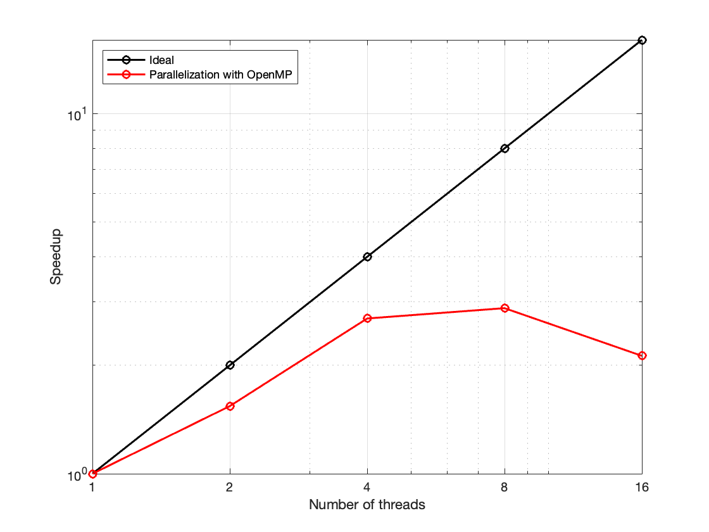
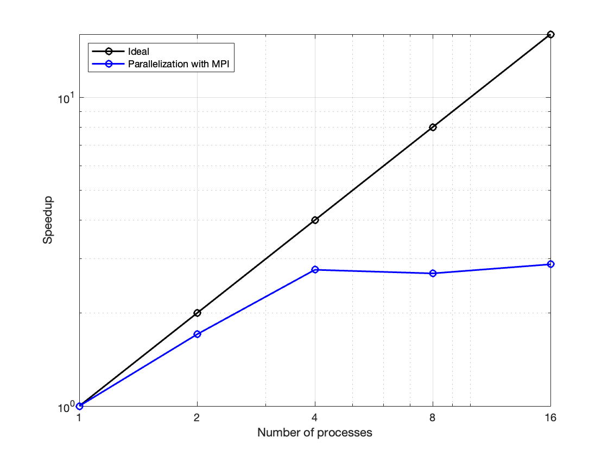
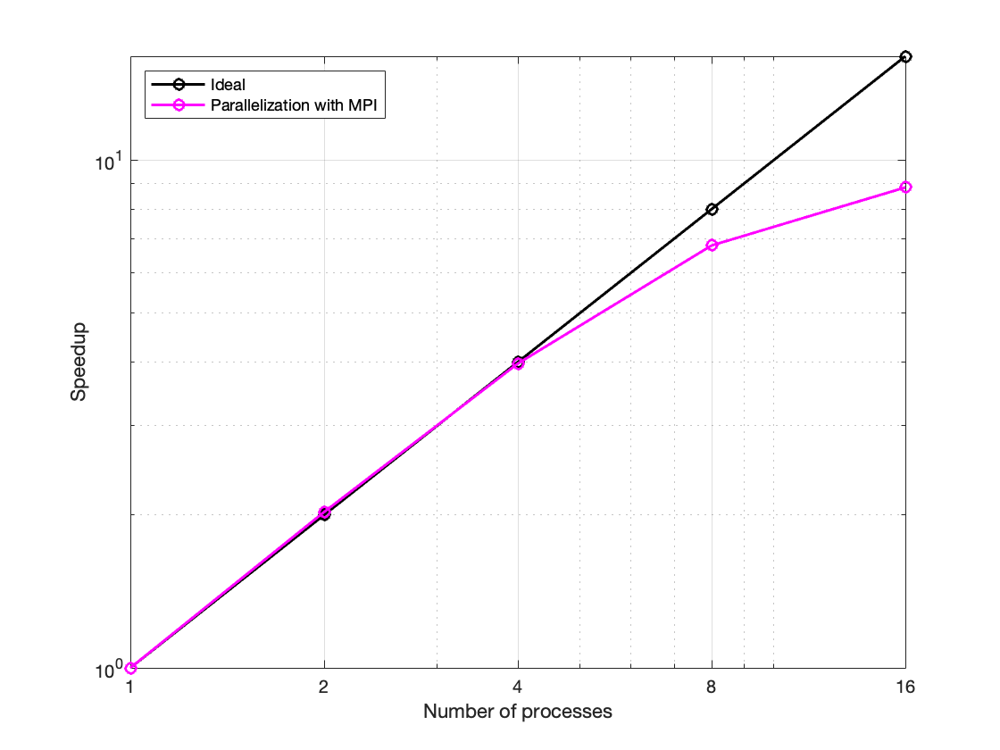

# Lab 2 report

Marc Aguilar and Alejandro Fernández

## Exercise 1: Hello World

There's not much to comment here. The code directly addresses all the tasks proposed by the exercise. In order to decide whether a process has an even or an odd rank, we've used the **modulo 2 operation**. The results can be found in the output file [1_hello_world/out_helloworld.out](1_hello_world/out_helloworld.out).

## Exercise 2: Dot Product

| Number of threads | Execution time (s) |
| ----------------- | ------------------ |
| 1                 | 0.0665             |
| 2                 | 0.0431             |
| 4                 | 0.0246             |
| 8                 | 0.0231             |
| 16                | 0.0313             |

*The execution times are an average of 5 runs.*

| Number of processes | Execution time (s) |
| ------------------- | ------------------ |
| 1                   | 0.0644             |
| 2                   | 0.0377             |
| 4                   | 0.0233             |
| 8                   | 0.0239             |
| 16                  | 0.0224             |

*The execution times are an average of 5 runs.*

As we can see from the graphs, both cases scale pretty poorly, even though we have only considered the dot product itself and the reduction necessary to combine the result from all processes. We believe that these results are this poor because the code is built to use both processes and threads at the same time, but with these tests we are only using multiple processes OR threads. Therefore, we are creating unnecessary overheads that greatly hamper the speedup.

That said, we can see that, when using multiple processes, the performance for 16 processes is not worse than with 8 processes, something that cannot be said for the case of using multiple threads. For this reason alone we consider that the second case is slightly better.

If now we combine multiple threads with multiple processes (which is the intended scenario) we obtained the following results:

| processes / threads | Execution time (s) |
| ------------------- | ------------------ |
| 2P / 12T            | 0.0203             |
| 4P / 6T             | 0.0188             |
| 6P / 4T             | 0.0189             |
| 12P / 2T            | 0.0239             |

*The execution times are an average of 5 runs.*

From these results we can deduce 2 things. The first one is that a balanced configuration (similar amount of processes and threads) seems to provide the best results. The second conclusion we can extract is that it seems that using multiple processes seems to carry a slightly higher overhead than using multiple threads, which in theory makes sense due to it being a more complex unit of execution.

Furthermore, it is interesting to notice that the best result obtained in this section is better than the best result obtained when just using threads or processes.

## Exercise 3: Matrix Vector Product

In this exercise we considered the idea of implementing the matrix vector product computation in parallel with a fixed number of threads (besides using multiple processes). But after some tests we realized that the results were better if we just used a single thread, since it seems that 16 processes and 4 threads creates too much of an overhead to be useful. Therefore, the following results have been obtained with the specified number of processes and just 1 thread:

| Number of processes | Execution time (s) |
| ------------------- | ------------------ |
| 1                   | 0.0647             |
| 2                   | 0.0319             |
| 4                   | 0.0163             |
| 8                   | 0.0095             |
| 16                  | 0.0073             |

*The execution times are an average of 5 runs.*

As we can observe the scaling obtained is pretty great. Up to 8 threads we basically get an ideal speedup, and then for 16 threads the rate of improvement decreases considerably. It should be noted, though, that this speedup does not take into account the parallel read, which seems to take most of the time of execution.

## Exercise 4: Broadcast (Gather)

The main aspect to highlight of this exercise is the fact that we created a derived datatype called `diagonal`. It is used to make easier the gathering process (despite the fact that the exercise was called broadcast we assumed it was a typo). 

After trying with 4 and 8 processes we got the results we expected. The execution with 4 processes takes **0.04 ms** and with 8 processes it takes **0.09 ms**, twice the first one. These results make sense since it is a weak scaling case because the size of the problem increases as the resources do. 

The overhead of having to send all the diagonals from each process and managing the data will be larger as the number of processes grow. We have also executed it with 16 processes and the results are worse than before.

## Exercise 5: Game of Life

This exercise was very straightforward since the algorithm was already implemented. We developed all the data management as it was detailed in both the report and the comments in the code. 
